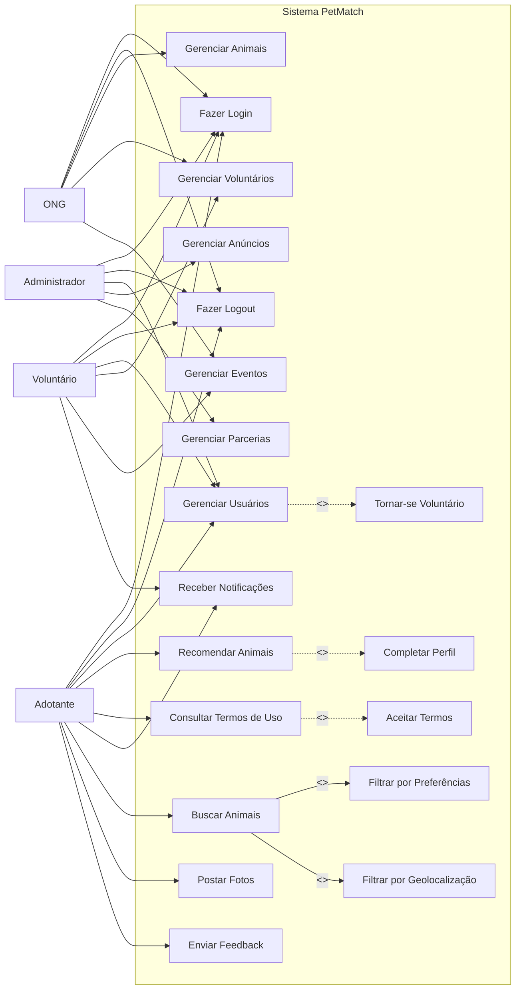
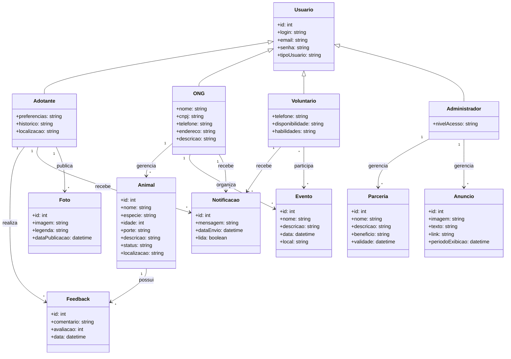

# 3. DOCUMENTO DE ESPECIFICAÇÃO DE REQUISITOS DE SOFTWARE

## 3.1 Objetivos deste documento
Descrever e especificar as necessidades dos usuários do sistema PetMatch, incluindo adotantes, ONGs de proteção animal e voluntários, que devem ser atendidas pela plataforma digital proposta, visando otimizar o processo de adoção de animais e promover a posse responsável.

## 3.2 Escopo do produto

### 3.2.1 Nome do produto e seus componentes principais
O produto será denominado **PetMatch**.

O sistema será composto pelos seguintes módulos principais:
- Módulo de gerenciamento de usuários (adotantes, ONGs e voluntários);
- Módulo de cadastro e gerenciamento de animais para adoção;
- Módulo de recomendação de animais com base no perfil do usuário;
- Módulo de busca e filtragem (preferências e geolocalização);
- Módulo de eventos de adoção;
- Módulo de voluntariado;
- Módulo de notificações;
- Módulo de conteúdo informativo e termos de uso;
- Módulo de feedback e avaliações;
- Módulo de parcerias e benefícios.

### 3.2.2 Missão do produto
Conectar adotantes, ONGs e voluntários em uma plataforma digital integrada, facilitando o processo de adoção responsável, promovendo o bem-estar animal e ampliando o alcance das ações de proteção animal por meio da tecnologia.

### 3.2.3 Limites do produto
O PetMatch não contempla:
- Processamento de pagamentos ou transações financeiras;
- Avaliação comportamental profissional dos animais;
- Responsabilidade legal sobre o processo de adoção (atuando apenas como intermediador);
- Serviços veterinários ou acompanhamento pós-adoção;
- Integração com sistemas governamentais ou bases oficiais de controle animal.

### 3.2.4 Benefícios do produto

| # | Benefício | Valor para o Cliente |
|---|----------|---------------------|
| 1 | Centralização de informações sobre animais disponíveis para adoção | Essencial |
| 2 | Facilidade na busca e filtragem de animais por perfil e localização | Essencial |
| 3 | Melhoria na comunicação entre usuários, ONGs e voluntários | Essencial |
| 4 | Aumento da visibilidade para ONGs e eventos de adoção | Essencial |
| 5 | Conexão facilitada entre voluntários e ONGs | Essencial |
| 6 | Recomendação personalizada de animais para adotantes | Recomendável |
| 7 | Redução do tempo de permanência dos animais em abrigos | Recomendável |
| 8 | Promoção da adoção responsável por meio de conteúdo educativo | Recomendável |

## 3.3 Descrição geral do produto

### 3.3.1 Requisitos Funcionais

| Código | Requisito Funcional (Funcionalidade) | Descrição |
|--------------------|------------------------------------|----------------------------------------|
| RF0 | Autenticar Usuário | Permitir que usuários realizem login e logout na plataforma com autenticação segura por e-mail e senha |
| RF1 | Gerenciar Usuários | Processamento de inclusão, alteração, exclusão e consulta de usuários |
| RF2 | Gerenciar Animais para Adoção | Processamento de cadastro, alteração, exclusão e consulta de animais disponíveis para adoção |
| RF3 | Filtrar Animais por Preferências | Permitir que usuários filtrem animais com base em suas preferências (porte, idade, espécie, etc.) |
| RF4 | Filtrar Animais por Geolocalização | Permitir que usuários filtrem animais com base em sua localização geográfica |
| RF5 | Recomendar Animais | Recomendar animais ao usuário com base em seu histórico de navegação |
| RF6 | Gerenciar Voluntários | Processamento de cadastro, alteração, exclusão e consulta de voluntários interessados em apoiar ONGs |
| RF7 | Gerenciar Eventos de Adoção | Processamento de cadastro, alteração, exclusão e consulta de eventos de adoção e feiras organizadas pelas ONGs |
| RF8 | Consultar Termos de Uso | Disponibilizar informações sobre os termos de uso do sistema |
| RF9 | Postar Fotos de Pets | Permitir que usuários publiquem fotos de pets com legendas |
| RF10 | Gerenciar Notificações | Enviar notificações sobre novos animais disponíveis e eventos |
| RF11 | Gerenciar Feedback dos Usuários | Permitir que usuários registrem comentários e avaliações sobre suas experiências |
| RF12 | Gerenciar Anúncios | Permitir a criação, edição, exclusão e exibição de anúncios no sistema |
| RF13 | Gerenciar Benefícios e Parcerias | Processamento de cadastro e gestão de benefícios para usuários em parceria com empresas do ramo pet |

### 3.3.2 Requisitos Não Funcionais

| Código | Requisito Não Funcional (Restrição) |
|--------------------|------------------------------------|
| RNF1 | O sistema deve ser responsivo e funcional em celulares, tablets e computadores. |
| RNF2 | O sistema deve garantir a segurança dos dados dos adotantes, ONGs e voluntários, seguindo a LGPD (Lei 13.709/2018). |
| RNF3 |	O sistema deve ser compatível com as versões mais recentes dos navegadores Google Chrome, Mozilla Firefox, Microsoft Edge e Safari. |
| RNF4 |	O tempo de resposta para buscas de animais na plataforma deve ser inferior a 3 segundos de performace. |
| RNF5 |	O código da aplicação deve ser modular e documentado, facilitando manutenção e evolução. |
| RNF6 |	A aplicação deve implementar autenticação e controle de acesso para proteger informações sensíveis (ex: dados de adotantes e ONGs). |

### 3.3.3 Usuários 

| Ator | Descrição |
|------|-----------|
| Administrador | Usuário responsável pela administração geral do sistema, com acesso completo às funcionalidades, incluindo gestão de usuários, conteúdos, anúncios e monitoramento da plataforma. |
| ONG | Usuário institucional responsável pelo cadastro e gerenciamento de animais disponíveis para adoção, eventos e oportunidades de voluntariado. |
| Adotante | Usuário interessado em adotar um animal, podendo buscar, filtrar, visualizar recomendações e interagir com ONGs. |
| Voluntário | Usuário interessado em apoiar ONGs, podendo se cadastrar e participar de atividades como eventos, transporte de animais ou lar temporário. |

## 3.4 Modelagem do Sistema

### 3.4.1 Diagrama de Casos de Uso

#### Figura 1: Diagrama de Casos de Uso do Sistema.

### 3.4.2 Descrições de Casos de Uso

#### Autenticar Usuário (CSU00)

**Sumário:** O usuário realiza login ou logout na plataforma PetMatch com e-mail e senha cadastrados.

**Ator Primário:** Usuário (Adotante / ONG / Voluntário / Administrador)

**Pré-condições:**
Para login: o usuário deve possuir cadastro ativo no sistema. Para logout: o usuário deve estar autenticado.

**Fluxo Principal (Login):**

1) O usuário acessa a tela de login.
2) O Sistema apresenta o formulário de autenticação (e-mail e senha).
3) O usuário preenche as credenciais e confirma.
4) O Sistema valida as credenciais.
5) O Sistema redireciona o usuário para a área correspondente ao seu perfil.

---

**Fluxo Alternativo (1): Credenciais Inválidas**

a) O Sistema identifica e-mail ou senha incorretos.
b) O Sistema exibe mensagem de erro.
c) O usuário pode tentar novamente ou solicitar redefinição de senha.

---

**Fluxo Principal (Logout):**

1) O usuário solicita encerramento de sessão.
2) O Sistema encerra a sessão e redireciona para a tela de login.

---

**Pós-condições:**
Usuário autenticado e com acesso às funcionalidades do seu perfil, ou sessão encerrada.

---

#### Gerenciar Animais (CSU01)

**Sumário:** A ONG realiza a gestão (inclusão, remoção, alteração e consulta) dos dados dos animais disponíveis para adoção.

**Ator Primário:** ONG  

**Pré-condições:**  
A ONG deve estar cadastrada e autenticada no sistema.

**Fluxo Principal:**

1) A ONG requisita a gestão de animais.  
2) O Sistema apresenta as operações disponíveis: inclusão, alteração, exclusão e consulta de animais.  
3) A ONG seleciona a operação desejada ou opta por finalizar o caso de uso.  
4) Caso deseje continuar, o fluxo retorna ao passo 2; caso contrário, o caso de uso é encerrado.

---

**Fluxo Alternativo (1): Inclusão**

a) A ONG solicita a inclusão de um novo animal.  
b) O Sistema apresenta um formulário para cadastro do animal (nome, espécie, idade, porte, descrição, fotos, status de saúde, localização).  
c) A ONG preenche os dados solicitados.  
d) O Sistema valida as informações.  
e) Se válidas, o animal é cadastrado; caso contrário, o sistema solicita correção dos dados.

---

**Fluxo Alternativo (2): Remoção**

a) A ONG seleciona um animal e solicita sua remoção.  
b) O Sistema verifica se o animal pode ser removido.  
c) Se permitido, realiza a remoção; caso contrário, informa a impossibilidade.

---

**Fluxo Alternativo (3): Alteração**

a) A ONG altera os dados de um animal.  
b) O Sistema valida as informações.  
c) Se válidas, atualiza os dados; caso contrário, informa o erro.

---

**Fluxo Alternativo (4): Consulta**

a) A ONG solicita a listagem ou busca de animais.  
b) O Sistema exibe os resultados.  
c) A ONG seleciona um animal para visualizar detalhes.

---

**Pós-condições:**  
Um animal foi cadastrado, alterado, removido ou consultado.

---

### Buscar e Filtrar Animais (CSU02)

**Sumário:** O adotante busca e filtra animais disponíveis para adoção com base em suas preferências.

**Ator Primário:** Adotante

**Pré-condições:**  
O usuário deve estar cadastrado e autenticado no sistema.

**Fluxo Principal:**

1) O adotante acessa a funcionalidade de busca de animais.  
2) O Sistema apresenta a lista de animais disponíveis.  
3) O adotante pode optar por visualizar os resultados ou aplicar filtros.  
4) O Sistema atualiza a lista conforme as interações do usuário.

---

**Fluxo Alternativo (1): Aplicar Filtros**

a) O adotante seleciona critérios de filtragem (espécie, porte, idade, localização, comportamento).  
b) O Sistema processa os critérios informados.  
c) O Sistema exibe apenas os animais compatíveis com os filtros.

---

**Pós-condições:**  
Lista de animais filtrada e exibida ao usuário.

---

### Recomendar Animais (CSU03)

**Sumário:** O sistema recomenda animais ao adotante com base em seu perfil e histórico de navegação.

**Ator Primário:** Adotante

**Pré-condições:**  
O usuário deve estar autenticado e possuir dados de perfil ou histórico no sistema.

**Fluxo Principal:**

1) O adotante acessa a área de recomendações.  
2) O Sistema analisa o perfil e histórico do usuário.  
3) O Sistema gera uma lista de animais recomendados.  
4) O adotante visualiza os animais sugeridos.

---

**Fluxo Alternativo (1): Perfil Incompleto**

a) O Sistema identifica que o perfil do usuário está incompleto.  
b) O Sistema solicita o preenchimento de preferências.  
c) Após preenchimento, o fluxo retorna ao passo 2.

---

**Pós-condições:**  
Lista personalizada de animais exibida ao usuário.

---

### Gerenciar Eventos de Adoção (CSU04)

**Sumário:** A ONG realiza a gestão de eventos de adoção.

**Ator Primário:** ONG

**Pré-condições:**  
A ONG deve estar cadastrada e autenticada no sistema.

**Fluxo Principal:**

1) A ONG acessa a funcionalidade de eventos.  
2) O Sistema apresenta as operações disponíveis: inclusão, alteração, exclusão e consulta de eventos.  
3) A ONG seleciona a operação desejada.  
4) O fluxo retorna ao passo 2 ou é encerrado.

---

**Fluxo Alternativo (1): Inclusão**

a) A ONG solicita a criação de um evento.  
b) O Sistema apresenta formulário (data, local, descrição, horário).  
c) A ONG preenche os dados.  
d) O Sistema valida e salva o evento.

---

**Fluxo Alternativo (2): Alteração**

a) A ONG seleciona um evento. 
b) A ONG altera os dados de um evento.  
c) O Sistema valida e atualiza as informações.

---

**Fluxo Alternativo (3): Remoção**

a) A ONG seleciona um evento.
b) A ONG solicita a exclusão de um evento.  
c) O Sistema realiza a exclusão, se permitido.

---

**Fluxo Alternativo (4): Consulta**

a) A ONG solicita a listagem de eventos.  
b) O Sistema exibe os eventos cadastrados.

---

**Pós-condições:**  
Evento cadastrado, atualizado, removido ou consultado.

---

### Gerenciar Voluntários (CSU05)

**Sumário:** A ONG gerencia voluntários interessados em colaborar.

**Ator Primário:** ONG

**Pré-condições:**  
A ONG deve estar autenticada no sistema.

**Fluxo Principal:**

1) A ONG acessa a área de voluntários.  
2) O Sistema apresenta a lista de voluntários cadastrados.  
3) A ONG seleciona um voluntário para visualizar detalhes ou realizar ações.

---

**Fluxo Alternativo (1): Aprovar Voluntário**

a) A ONG seleciona um voluntário.  
b) A ONG aprova sua participação.  
c) O Sistema atualiza o status do voluntário.

---

**Fluxo Alternativo (2): Rejeitar Voluntário**

a) A ONG seleciona um voluntário.  
b) A ONG rejeita a solicitação.  
c) O Sistema registra a decisão.

---

**Pós-condições:**  
Voluntário aprovado, rejeitado ou consultado.

---

### Enviar Feedback (CSU06)

**Sumário:** O adotante registra sua experiência após o processo de adoção.

**Ator Primário:** Adotante

**Pré-condições:**  
O usuário deve estar autenticado e ter participado de uma adoção.

**Fluxo Principal:**

1) O adotante acessa a área de feedback.  
2) O Sistema apresenta formulário de avaliação.  
3) O adotante preenche comentários e nota.  
4) O Sistema valida e registra o feedback.

---

**Pós-condições:**  
Feedback registrado no sistema.

---

### Receber Notificações (CSU07)

**Sumário:** O sistema envia notificações ao usuário sobre novos animais e eventos.

**Ator Primário:** Sistema  
**Ator Secundário:** Usuário (Adotante/Voluntário/ONG)

**Pré-condições:**  
O usuário deve estar cadastrado e com notificações ativas.

**Fluxo Principal:**

1) O Sistema identifica um evento relevante (novo animal ou evento).  
2) O Sistema envia notificação ao usuário.  
3) O usuário visualiza a notificação.

---

**Pós-condições:**  
Usuário informado sobre atualizações relevantes.

---

### Gerenciar Usuários (CSU08)

**Sumário:** O sistema permite o gerenciamento de usuários, incluindo cadastro, atualização, remoção e definição de perfil (adotante, voluntário ou ONG).

**Ator Primário:** Usuário (Adotante/Voluntário/ONG)  
**Ator Secundário:** Administrador

**Pré-condições:**  
O usuário deve estar autenticado no sistema (exceto para cadastro).

**Fluxo Principal:**

1) O usuário acessa a área de gerenciamento de conta.  
2) O Sistema apresenta as opções: cadastro, atualização, exclusão e consulta de dados.  
3) O usuário seleciona a operação desejada.  
4) O Sistema executa a operação e retorna ao menu principal.

---

**Fluxo Alternativo (1): Cadastro**

a) O usuário solicita a criação de conta.  
b) O Sistema apresenta formulário de cadastro.  
c) O usuário preenche os dados (nome, email, senha, tipo de usuário).  
d) O Sistema valida e cria a conta.

---

**Fluxo Alternativo (2): Tornar-se Voluntário**

a) O usuário acessa a opção de voluntariado.  
b) O Sistema apresenta formulário de habilidades e disponibilidade.  
c) O usuário preenche os dados.  
d) O Sistema atualiza o perfil para incluir o status de voluntário.

---

**Fluxo Alternativo (3): Atualização**

a) O usuário altera seus dados cadastrais.  
b) O Sistema valida e atualiza as informações.

---

**Fluxo Alternativo (4): Remoção**

a) O usuário solicita exclusão da conta.  
b) O Sistema confirma a ação.  
c) O Sistema remove o cadastro.

---

**Pós-condições:**  
Usuário cadastrado, atualizado, removido ou com perfil de voluntário definido.

---

### Consultar Termos de Uso (CSU09)

**Sumário:** O usuário consulta os termos de uso da plataforma.

**Ator Primário:** Usuário

**Pré-condições:**  
Nenhuma.

**Fluxo Principal:**

1) O usuário acessa a opção “Termos de Uso”.  
2) O Sistema apresenta o conteúdo dos termos.  
3) O usuário realiza a leitura.

---

**Fluxo Alternativo (1): Aceite dos Termos**

a) O Sistema solicita o aceite dos termos (em cadastro ou primeiro acesso).  
b) O usuário aceita os termos.  
c) O Sistema registra o aceite.

---

**Pós-condições:**  
Termos visualizados e, quando aplicável, aceitos pelo usuário.

---

### Gerenciar Anúncios (CSU10)

**Sumário:** O administrador gerencia anúncios exibidos na plataforma.

**Ator Primário:** Administrador

**Pré-condições:**  
O administrador deve estar autenticado no sistema.

**Fluxo Principal:**

1) O administrador acessa a área de anúncios.  
2) O Sistema apresenta as opções: inclusão, alteração, exclusão e consulta.  
3) O administrador seleciona a operação desejada.  
4) O Sistema executa a operação.

---

**Fluxo Alternativo (1): Inclusão**

a) O administrador solicita a criação de um anúncio.  
b) O Sistema apresenta formulário (imagem, texto, link, período de exibição).  
c) O administrador preenche os dados.  
d) O Sistema valida e publica o anúncio.

---

**Fluxo Alternativo (2): Alteração**

a) O administrador altera dados de um anúncio.  
b) O Sistema valida e atualiza.

---

**Fluxo Alternativo (3): Remoção**

a) O administrador solicita exclusão de um anúncio.  
b) O Sistema remove o anúncio.

---

**Fluxo Alternativo (4): Consulta**

a) O administrador solicita listagem de anúncios.  
b) O Sistema exibe os registros.

---

**Pós-condições:**  
Anúncio cadastrado, atualizado, removido ou consultado.

---

### Gerenciar Parcerias e Benefícios (CSU11)

**Sumário:** O administrador gerencia parcerias com empresas e benefícios oferecidos aos usuários.

**Ator Primário:** Administrador

**Pré-condições:**  
O administrador deve estar autenticado.

**Fluxo Principal:**

1) O administrador acessa a área de parcerias.  
2) O Sistema apresenta as opções: inclusão, alteração, exclusão e consulta.  
3) O administrador seleciona a operação desejada.  
4) O Sistema executa a operação.

---

**Fluxo Alternativo (1): Inclusão**

a) O administrador cadastra uma nova parceria.  
b) O Sistema solicita dados (nome da empresa, tipo de benefício, descrição, validade).  
c) O administrador preenche as informações.  
d) O Sistema valida e salva.

---

**Fluxo Alternativo (2): Alteração**

a) O administrador altera dados da parceria.  
b) O Sistema valida e atualiza.

---

**Fluxo Alternativo (3): Remoção**

a) O administrador solicita exclusão.  
b) O Sistema remove a parceria.

---

**Fluxo Alternativo (4): Consulta**

a) O administrador solicita listagem.  
b) O Sistema exibe as parcerias cadastradas.

---

**Pós-condições:**  
Parceria ou benefício cadastrado, atualizado, removido ou consultado.

---

### 3.4.3 Diagrama de Classes 

O diagrama de classes apresentado na Figura 14 representa a estrutura estática do sistema PetMatch, evidenciando as principais entidades envolvidas e seus relacionamentos. A classe Usuário atua como superclasse, sendo especializada em diferentes perfis: Adotante, ONG, Voluntário e Administrador, cada um com atributos específicos conforme seu papel na plataforma. As ONGs são responsáveis pelo gerenciamento dos Animais disponíveis para adoção e pela organização de Eventos, enquanto os adotantes podem interagir com o sistema por meio do envio de Feedbacks, publicação de Fotos e recebimento de Notificações. Os voluntários, por sua vez, podem participar de eventos promovidos pelas ONGs. O sistema também contempla funcionalidades administrativas, como o gerenciamento de Parcerias e Anúncios, realizadas pelo Administrador. Dessa forma, o diagrama demonstra de forma clara a organização das classes e as interações entre os diferentes atores e funcionalidades do sistema, refletindo os requisitos definidos para a plataforma.

#### Figura 14: Diagrama de Classes do Sistema.

### 3.4.4 Descrições das Classes 

| # | Nome | Descrição |
|---|------|----------|
| 1 | Usuário | Armazena informações gerais dos usuários do sistema (login, senha, tipo de usuário). |
| 2 | Adotante | Representa usuários interessados em adotar animais, incluindo preferências e histórico. |
| 3 | ONG | Representa organizações responsáveis pelo cadastro de animais e eventos. |
| 4 | Animal | Contém dados dos animais disponíveis para adoção (espécie, idade, porte, descrição, status). |
| 5 | Evento | Representa eventos de adoção organizados pelas ONGs. |
| 6 | Voluntário | Armazena dados de usuários que desejam apoiar ONGs. |
| 7 | Notificação | Responsável pelo envio de alertas sobre animais e eventos. |
| 8 | Feedback | Registra avaliações e comentários dos usuários sobre adoções e experiências. |
| 9 | Parceria | Gerencia benefícios e parcerias com empresas do ramo pet. |
